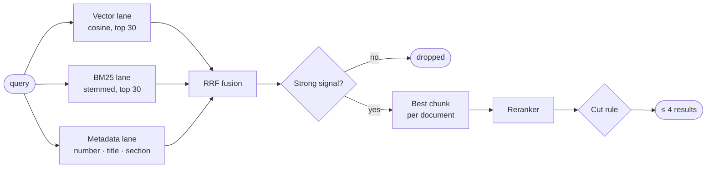

<div align="center">


# Hybrid RAG Search

**Find the right procedure from a plain-language question.<br>Vector + BM25 + metadata, fused with RRF, cut by a reranker.**


<table>
<tr>
<td align="center" width="33%"><h3>0.93 precision</h3>answers shown are the right ones<br><sub>244-query benchmark, reranker on</sub></td>
<td align="center" width="33%"><h3>0 / 64 leaks</h3>off-topic questions return nothing<br><sub>out-of-scope negatives</sub></td>
<td align="center" width="33%"><h3>≤ 4 results</h3>a short list, not a ranked dump<br><sub>reranker threshold cut</sub></td>
</tr>
</table>

**[Why](#why) · [Quick start](#quick-start) · [How it works](#how-it-works) · [API](#api) · [Configuration](#configuration) · [Benchmark](#benchmark) · [Docs](#documentation)**

</div>

---

## Why

Keyword search over procedure documents fails in two ways. It misses the document when the user's words differ from the document's words, and it floods the page when a common word appears everywhere.

<table>
<tr>
<th width="50%">Keyword search · 9 results</th>
<th width="50%">Hybrid RAG Search · 1 result</th>
</tr>
<tr>
<td valign="top">

> **query:** *what do we do when the data center is down*
>
> 1. Network Security · *"...data center access..."*
> 2. Physical Security · *"...data center visitors..."*
> 3. Asset Management · *"...data center inventory..."*
> 4. Backup and Restore
> 5. ... 5 more

</td>
<td valign="top">

> **query:** *what do we do when the data center is down*
>
> 1. **Disaster Recovery Plan** · *5. Recovery Procedure*<br>
>    *"Activate the disaster recovery site within four hours of a declared outage."*

</td>
</tr>
</table>

**Same documents. The right one, and only the right one.**

<sub>Illustrative example with generic document names.</sub>

| | |
|---|---|
| **Understands meaning** | Indonesian or English, paraphrases and typos reach the same document |
| **Keeps exact matches** | Clause numbers (`a.8.23`), document numbers and titles still win |
| **Says nothing when unsure** | Every candidate needs one strong signal; off-topic queries return an empty list |
| **Reads diagrams** | Figures inside PDFs are OCR-ed and searchable, labeled with their section and caption |
| **Explains itself** | Every result carries its cosine, BM25, coverage, metadata and rerank scores |
| **Degrades gracefully** | No embedding server: keyword mode. Reranker down: uncut results instead of an error |

## Quick start

**Requirements:** Go 1.25+, `poppler` (`pdftotext`, `pdftohtml`), `tesseract`. An OpenAI-compatible embedding endpoint is optional but recommended.

```bash
git clone https://github.com/llem0on/hybrid-rag-sop-search.git
cd hybrid-rag-sop-search
cp .env.example .env          # fill LLM_BASE_URL, LLM_API_KEY, RERANK_MODEL
make run                      # http://localhost:8080
```

Index a folder of PDFs and ask a question:

```bash
make ingest DIR=./pdfs

curl -s localhost:8080/search \
  -d '{"query": "how often is the database backed up"}' | jq
```

Or with Docker:

```bash
make docker
docker run -p 8080:8080 --env-file .env -v $PWD/data:/app/data hybrid-rag-sop-search
```

<sub>On macOS: <code>brew install poppler tesseract</code>. On Debian/Ubuntu: <code>apt install poppler-utils tesseract-ocr</code>.</sub>

## How it works



1. **Three lanes.** Cosine similarity over chunk vectors, BM25 with Indonesian stemming, and a metadata match on document number, title and section.
2. **Fusion.** Reciprocal Rank Fusion merges the lanes by rank, so raw scores on different scales never have to be compared.
3. **Relevance gate.** A candidate survives only with metadata ≥ 0.80, BM25 ≥ 12 with ≥ 50% query coverage, or cosine ≥ 0.60.
4. **Rerank and cut.** A cross-encoder scores each document. Rank 1 needs rerank ≥ 0.15 or cosine ≥ 0.65. Others need rerank ≥ 0.50. At most 4 are shown.

Indexing follows the document's own structure: numbered headings become chunks (target 500, max 700 tokens), each wrapped with a short header of title, section and purpose before embedding.

Full details: [Search pipeline](docs/search.md) · [Indexing pipeline](docs/indexing.md) · [Architecture](docs/architecture.md)

## API

| Method | Path | Description |
|---|---|---|
| `POST` | `/documents` | Upload a PDF (`multipart/form-data`: `file`, optional `title`, `number`, `department`) |
| `GET` | `/documents` | List indexed documents |
| `DELETE` | `/documents/{id}` | Remove a document and its chunks |
| `POST` | `/search` | `{"query": "..."}` → ranked results with scores |
| `GET` | `/figures/{name}` | Image of a figure chunk |
| `GET` | `/health` | Status, document count, enabled models |

```json
{
  "query": "how often is the database backed up",
  "mode": "hybrid",
  "reranked": true,
  "took_ms": 412,
  "results": [
    {
      "document": { "id": 3, "number": "DOC 01.001.01", "title": "Data Backup and Restore" },
      "section": "3. Procedure",
      "page_start": 2,
      "page_end": 3,
      "snippet": "A full backup of every production database runs daily at 01:00.",
      "pass": "semantic",
      "lanes": ["semantic", "keyword"],
      "scores": { "final": 0.0327, "cosine": 0.8235, "bm25": 13.1, "coverage": 1, "metadata": 0, "rerank": 0.74 }
    }
  ]
}
```

More in [docs/api.md](docs/api.md).

## Configuration

Everything is set through environment variables. Leave `LLM_BASE_URL` empty to run without models.

| Variable | Default | Purpose |
|---|---|---|
| `LLM_BASE_URL` | *(empty)* | OpenAI-compatible base URL, e.g. `http://localhost:4000/v1` |
| `LLM_API_KEY` | *(empty)* | Bearer token for the endpoint |
| `EMBED_MODEL` | `qwen3-vl-embedding-8b` | Embedding model name |
| `RERANK_MODEL` | *(empty)* | Reranker model name; empty disables reranking |
| `MIN_SEMANTIC` | `0.60` | Cosine floor for the semantic pass |
| `BM25_MIN` | `12` | BM25 floor for the keyword pass |
| `RERANK_MIN` | `0.5` | Rerank floor for ranks 2 and below |
| `MAX_RESULTS` | `4` | Maximum results after the cut |

All variables: [docs/configuration.md](docs/configuration.md).

## Benchmark

Measured on an internal set of about 50 procedure documents (470 chunks) with 244 hand-labeled queries: 180 answerable, 64 out of scope.

| | Precision | Recall |
|---|---:|---:|
| Answers | **0.93** | **0.93** |
| Answers + related documents | **0.95** | **0.88** |
| Off-topic queries returning a result | | **0 / 64** |

<sub>Precision counts queries where the reranker answered within its timeout (239 of 244). Including the 5 timeouts, which return uncut results, answer precision is 0.89.</sub>

<sub>Models: Qwen3-VL-Embedding-8B and Qwen3-VL-Reranker-8B, quantized Q8, self-hosted behind LiteLLM. Run your own numbers with <code>make eval</code>, see <a href="docs/evaluation.md">docs/evaluation.md</a>.</sub>

## Project layout

```text
cmd/
  server/        HTTP service
  ingest/        bulk upload of a PDF folder
  eval/          precision, recall and MRR on a labeled dataset
internal/
  chunker/       PDF text, cleanup, heading detection, section chunks
  figures/       image extraction, OCR, heading and caption lookup
  embedding/     chat template, contextual header, embedding and rerank client
  bm25/          BM25 index with Sastrawi stemming and coverage
  search/        lanes, RRF fusion, relevance gate, rerank cut
  indexer/       PDF to chunks to vectors
  store/         JSON file store
  api/           HTTP handlers
docs/            architecture, pipelines, API, configuration, evaluation
```

## Documentation

| | |
|---|---|
| [Architecture](docs/architecture.md) | Components, data model, request lifecycle |
| [Indexing pipeline](docs/indexing.md) | Cleanup, heading detection, chunking, figures, embedding format |
| [Search pipeline](docs/search.md) | Lanes, fusion, relevance gate, reranker cut |
| [API](docs/api.md) | Endpoints, request and response shapes |
| [Configuration](docs/configuration.md) | Every environment variable and how to tune it |
| [Evaluation](docs/evaluation.md) | Dataset format, metrics, running the benchmark |
| [n8n workflows](docs/n8n.md) | Production embedding flow through n8n |

## License

[MIT](LICENSE)
