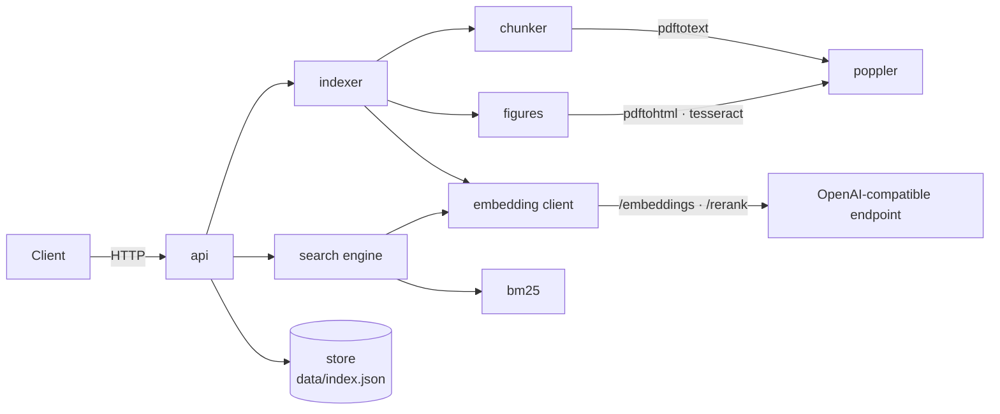
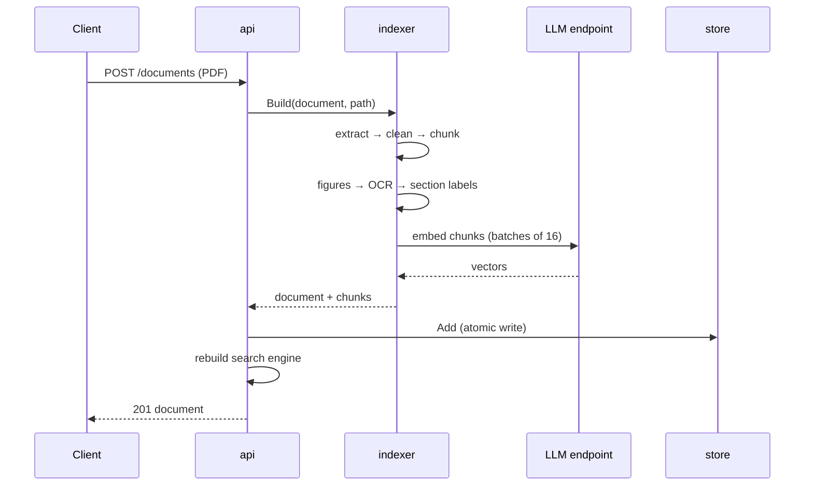
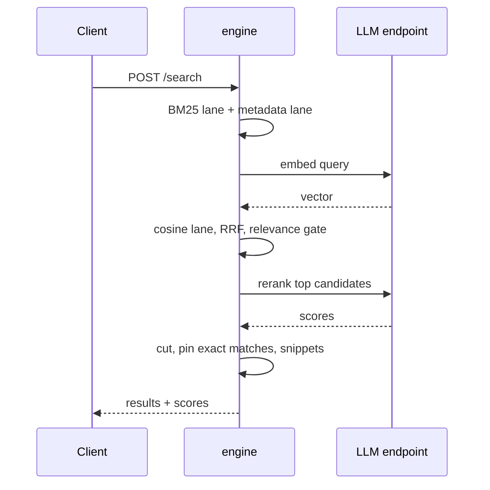

# Architecture

## Components



| Package | Responsibility |
|---|---|
| `api` | HTTP routes, upload handling, engine rebuild after every change |
| `indexer` | Turns one PDF into chunks with vectors |
| `chunker` | Text extraction, boilerplate cleanup, heading detection, section chunks |
| `figures` | Image extraction, OCR, nearest heading and caption |
| `embedding` | Chat template, contextual header, HTTP client for embeddings and rerank |
| `bm25` | Tokenizer with Sastrawi stemming, BM25 index, query coverage |
| `search` | Lanes, fusion, relevance gate, rerank cut, snippet |
| `store` | Documents and chunks persisted as one JSON file, written atomically |

## Data model

```text
Document
  id, number, title, department, file_name, chunks, figures, created_at

Chunk
  id, document_id, index, section, page_start, page_end
  content, tokens
  figure_path        set only for figure chunks
  vector             float32, one per chunk
```

## Request lifecycle

### Upload



### Search



## In-memory index

The engine holds every chunk vector and the BM25 index in memory. It is rebuilt from the store after each upload or delete and swapped under a lock, so searches never see a half-built index. Cosine over a few thousand 4096-dimensional vectors takes milliseconds; no vector database is needed at this size.

## Failure behaviour

| Failure | Behaviour |
|---|---|
| No `LLM_BASE_URL` | Keyword mode: BM25 and metadata lanes only |
| Query embedding fails or exceeds 15 s | That search runs in keyword mode |
| Reranker fails or exceeds `RERANK_TIMEOUT` | Fused results returned without the cut, `reranked: false` |
| Figure extraction or OCR fails | Document is indexed with its text chunks only |
| Document embedding fails | Upload returns 422; nothing is stored, extracted figures are removed |
