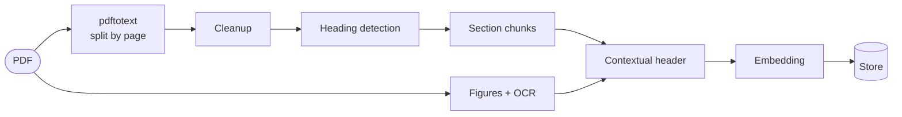

# Indexing Pipeline



## 1. Cleanup

Procedure documents repeat a company header, a document-control block and a page counter on every page. Left in, those lines appear in every chunk and make unrelated chunks look alike.

| Rule | Removes |
|---|---|
| Line on ≥ half of the pages (min. 2), shorter than 80 characters, not a heading | Repeated header and footer |
| `Page 3`, `Page 3 of 10`, `Halaman 3 dari 10`, `3/10` | Page counters |
| Repeated spaces and blank lines | Layout noise |

## 2. Heading detection

Chunks follow the document's own sections, so headings have to be found reliably.

| Style | Examples |
|---|---|
| Arabic | `1. Purpose`, `3.2 Procedure`, `4.1.2. Approval` |
| Letter | `A. Scope` |
| Roman | `II. Responsibilities` |
| Chapter | `BAB II`, `CHAPTER 3` |

| Guard | Rejects |
|---|---|
| First number has fewer than 4 digits | `2024 Annual review` |
| First word is not a month | `12 January 2024` |
| Title has letters and does not end with a period | `1. This is a full sentence.` |
| Ordinals are sequential per style | a list item `3.` inside section 1 |
| ≥ 3 lines between two headings of one style | dense numbered lists |
| A style counts only when it appears ≥ 2 times | a single stray `A.` |
| An ordinal alone on a line joins the next line | `1.` followed by `Purpose` |

## 3. Chunking

| Setting | Value |
|---|---|
| Unit | one section: heading + body |
| Kept whole | ≤ 700 estimated tokens |
| Long sections | split at paragraph breaks, target 500 tokens |
| Overlap | last 80 words of the previous piece |
| Token estimate | `max(characters / 4, words)` |

Every piece of a long section starts with the section title, so it keeps its context.

## 4. Figures

Flowcharts and matrices carry information `pdftotext` cannot see.

1. `pdftohtml -xml` lists every image and every text line with its position.
2. Full-page backgrounds and duplicate positions are skipped.
3. Each image is OCR-ed with `tesseract`; images with fewer than 30 characters are dropped.
4. The figure is labeled from the page layout:
   - **heading:** nearest numbered heading above the image, searching back across pages;
   - **caption:** closest line within 60 px above, else within 30 px below;
   - lines in the top 17% and bottom 10% of a page are ignored (page header and footer).
5. The figure becomes its own chunk, for example `Figure on page 5 · 4.2 Likelihood - Impact Matrix`, with an image served at `/figures/{name}`.

## 5. Contextual header

Each chunk is embedded with a short header in front:

```text
---
Document Title: Data Backup and Restore
Section: 3. Procedure
Description: This procedure ensures business data can be restored after a failure.
---
<chunk content>
```

`Description` is the first sentence (20 to 400 characters) of the document's *Purpose* / *Tujuan* section. It tells every chunk what its document is for, which helps topic-style questions.

Figure chunks use the header **without** `Description`. OCR text is short, and a long purpose sentence would dominate its vector.

## 6. Embedding format

The instruction goes into the system turn of the chat template, on both sides:

```text
<|im_start|>system
{instruction}
<|im_end|>
<|im_start|>user
{text}
<|im_end|>
<|im_start|>assistant
```

| Side | Default instruction |
|---|---|
| Document | `Represent the user's input.` |
| Query | `Retrieve relevant documents for the query.` |

Both are configurable (`DOC_INSTRUCTION`, `QUERY_INSTRUCTION`). Changing either means re-indexing every document, because query and document vectors must come from the same format.
