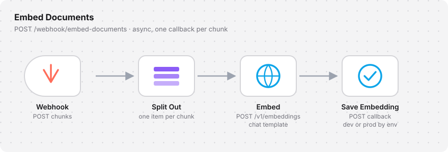
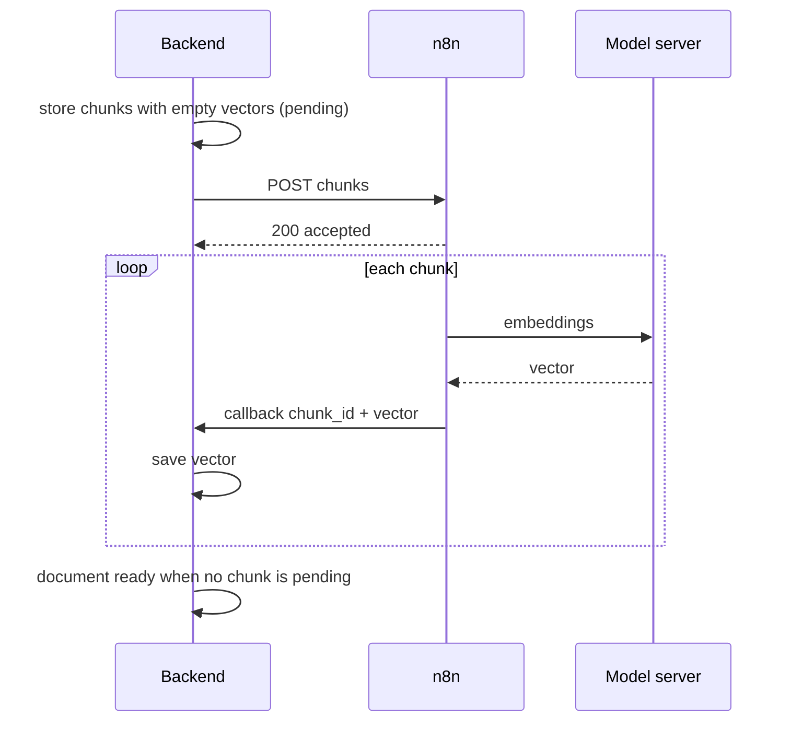
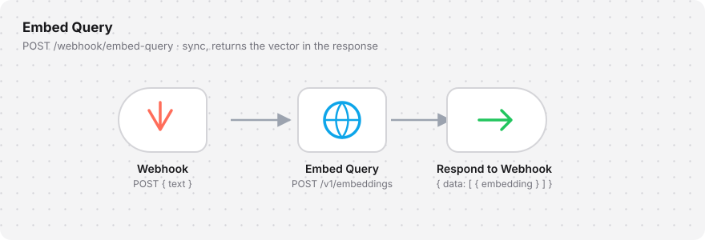

# n8n Workflows

In production the backend does not call the model server directly. Two n8n workflows sit in between: one embeds document chunks, one embeds search queries. Keeping the prompt template in n8n means the template can change without redeploying the backend, and one workflow can serve several environments.

This repository calls the model endpoint directly (`LLM_BASE_URL`) so it runs with nothing but a model server. The workflows below are the production variant of the same calls.

## Embed Documents

<p align="center">
  
</p>

Runs **asynchronously**. The backend hands over a batch of chunks and returns immediately; vectors arrive one by one through a callback.

| Node | Does |
|---|---|
| **Webhook** | Receives `{ document_id, env, data: [ { chunk_id, text } ] }` |
| **Split Out** | Turns `data` into one item per chunk, so each chunk is embedded and saved on its own |
| **Embed** | `POST /v1/embeddings` with the chat template. Figure chunks are sent as their OCR text |
| **Save Embedding** | `POST` back to the backend: `{ chunk_id, embedding, model }`. The callback URL is picked from `env`, so development and production share one workflow |



A chunk with an empty vector doubles as the work queue: a failed callback simply leaves the chunk pending, and re-sending pending chunks retries only what is missing.

## Embed Query

<p align="center">
  
</p>

Runs **synchronously**, because a search waits for its vector.

| Node | Does |
|---|---|
| **Webhook** | Receives `{ text }`, the normalized query |
| **Embed Query** | `POST /v1/embeddings` with the same template as documents |
| **Respond to Webhook** | Returns the OpenAI-style response `{ data: [ { embedding } ] }` |

## Prompt template

Both workflows wrap the text the same way. Query and document vectors are only comparable when they come from the same template.

```text
<|im_start|>system
{instruction}
<|im_end|>
<|im_start|>user
{text}
<|im_end|>
<|im_start|>assistant
```

As an n8n expression in the **Embed Query** node:

```js
{{ JSON.stringify({
  model: "qwen3-vl-embedding-8b",
  input: "<|im_start|>system\n" + $vars.QUERY_INSTRUCTION + "\n<|im_end|>\n<|im_start|>user\n"
       + $json.body.text + "\n<|im_end|>\n<|im_start|>assistant\n"
}) }}
```

Changing the instruction in one workflow means changing it in the other and re-embedding every document.
