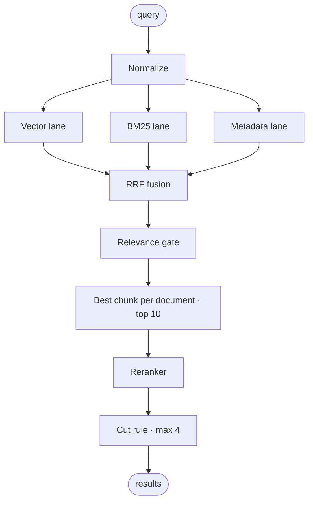

# Search Pipeline



## 1. Lanes

### Vector

- The query is embedded with the query instruction.
- Cosine similarity against every chunk vector; the top 30 chunks keep their rank.

### BM25

- Tokens are lowercase alphanumeric runs; dotted numbers like `a.8.23` stay whole.
- 37 stopwords are removed (Indonesian function words and a few English ones).
- Words are stemmed with Sastrawi, so `pencadangan` matches `cadangan`. Tokens with digits are not stemmed.
- `k1 = 1.2`, `b = 0.75`, `idf = ln(1 + (N − df + 0.5) / (df + 0.5))`.
- **Coverage** = share of distinct query terms found in the chunk. A long chunk that repeats one rare word scores high on BM25 but low on coverage.

### Metadata

| Match | Score |
|---|---:|
| Document number equals the query | 1.00 |
| Title equals the query | 0.95 |
| Title or number contains the query | 0.80 |
| Section title contains the query | 0.65 |
| Department equals the query | 0.40 |

Numbers are compared on letters and digits only: `DOC 12.003.01`, `doc12.003.01` and `DOC-12-003-01` are the same number.

## 2. Fusion

```text
final = ws / (k + rank_vector)
      + wk / (k + rank_bm25)
      + 1  / (k + rank_metadata)
      + cosine × 0.0001                 tie-break
      + 1.0 if metadata ≥ 0.95          exact title or number

k = 60   ws : wk = 0.8 : 0.2, scaled so that ws + wk = 2
```

Reciprocal Rank Fusion works on ranks, so cosine (≈ 0.3–0.9), BM25 (0–30+) and metadata (0.4–1.0) never need a shared scale.

## 3. Relevance gate

Fusion always produces a ranking, even for nonsense. Each candidate must bring one strong signal of its own:

| Pass | Condition |
|---|---|
| `metadata` | metadata ≥ 0.80 |
| `bm25_strong` | BM25 ≥ 12 **and** coverage ≥ 50% |
| `semantic` | cosine ≥ 0.60 |

Everything else is dropped. Each document keeps only its best chunk, and the top 10 documents go to the reranker.

## 4. Rerank and cut

Each candidate is sent to the reranker as:

```text
Document: {title}
Section: {section}

{first 800 characters of the chunk}
```

Results keep their fused order. A result is shown when:

| Position | Condition |
|---|---|
| Rank 1 | rerank ≥ 0.15 · or cosine ≥ 0.65 · or metadata ≥ 0.80 |
| Rank 2+ | rerank ≥ 0.50 · or metadata ≥ 0.80 |
| All | at most 4 results |

Rank 1 gets a lower bar because the best fused match is usually right; the extra cosine condition keeps a strong semantic match even when the reranker is unsure. Off-topic queries fail both and return nothing.

Exact title or number matches are pinned to the top.

## 5. Response

Each result carries the document, section, page range, a snippet (the sentence with the most query terms), the pass reason, the lanes that found it and every score. Figure chunks also carry `figure_path`.

## Tuning

| Symptom | Adjust |
|---|---|
| Off-topic queries return results | raise `RERANK_TOP_MIN` or `RERANK_TOP_COS` |
| Second relevant document often missing | lower `RERANK_MIN` (expect lower precision) |
| Exact-phrase queries miss in small corpora | lower `BM25_MIN`; BM25 scores grow with corpus size |
| Too many weak semantic candidates | raise `MIN_SEMANTIC` |
| New embedding model | recalibrate `MIN_SEMANTIC` and `RERANK_TOP_COS` with `make eval` |
